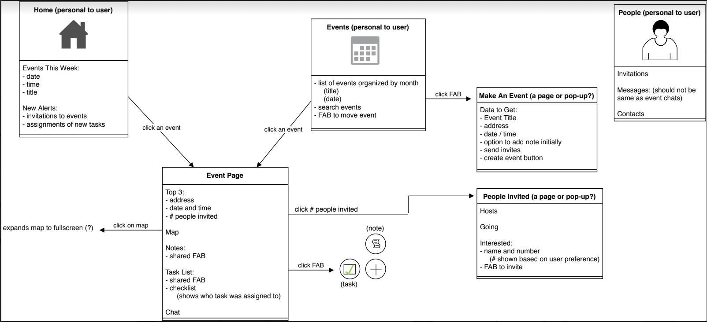

# Host-It
Final Project for 330 Software Engineering
   
[Project Proposal](https://docs.google.com/document/d/1B1j3uAakMvVkk_gpCVfzmqgGeecr8w3iG_uVXuIH5Xw/edit "Open Google Doc")
 
[Original Software Requirements Report](https://docs.google.com/document/d/1-kEkb2ZCvJvYeIbxUi5uyMOFOTTiTnIZDThce5lOdiA/edit?usp=sharing "Open Google Doc")
___
# Table of Contents
1. [Introduction](#intro)
2. [Overall Description](#overall-description)
3. [External Interface Requirements](#external-interface-requirements)
4. [System Features](#system-features)
5. [Other Nonfunctional Requirements](#other-nonfunctional-requirements)
6. [Other Requirements](#other-requirements)
## Software Requirements
### 1. Introduction 
<dl>
<dt> Purpose </dt>
<dd> This product is a mobile application. The application is intended to provide the necessary organizational tools to help plan an event efficiently. Features include a login page, an event manager page, event pages, invitation lists, task lists, and a messaging system featuring posts. This project will be a learning experience in cordova and mobile application development. </dd>
<dt> Document Conventions </dt>
<dd> No specific conventions that need to be addressed used throughout this document </dd>
<dt> Intended Audience and Reading Suggestions </dt>
<dd> This document is intended for the individuals in COMP 330 and for those that will be reviewing it. This document outlines different aspects of the mobile application and discusses the technologies used and features implemented. Additionally, this document is intended for the other members of this course and the instructors to understand the functions of the code. This document should be read in order to utilize the application at its full potential.
 </dd>
<dt> Product Scope </dt>
<dd> This project will be written in cordova. This software was chosen in order to lend the project to cross-platform compatibility. For this project however, we will focus on functionality with iOS applications first in order to ensure the completion of the project. The project will also serve as a learning experience in mobile application development, as described above.
 </dd>
<dt> References </dt>
<dd> This document may make references to the google API in implementing the google maps API. </dd>
</dl>

### 2. Overall Description 
<dl>
<dt> Product Description </dt>
<dd> The idea, as described, was originated from personal experiences with planning and preparing for hosted events. With this product, we hope to take on the functionality of creating events on Facebook and make a better mobile way to do so and keep track of components of such events. With the transition from Facebook to other social media sites, we hope this application works as a more receptive replacement for the events function of Facebook.  </dd>
<dt> Product Functions </dt>
<dd> The main functionality of this product is in helping plan and prepare for self-hosted events. As of now, we are continuously working to make user flow of the application seamless for the target audience of young adults. The detailed functionality is shown in the UML diagram that can be found in Appendix B. </dd>
<dt> User Classes and Characteristics </dt>
<dd> Paragraph <dd>
<dt> Operating Environment </dt>
<dd> This application as of now is being developed with a focus on iOS devices, however in the future we hope to have a version developed for Android devices as well. It will be running through the Cordova framework for mobile applications, using a website baseline in terms of languages being used (HTML5/CSS3, JS). Any iPhone would ideally be able to display this application, however we are using an iPhone XS as the simulator in development.
 </dd>
<dt> Design and Implementation Constraints </dt>
<dd> This application will need to be run in a mobile setting using HTML5/CSS3 and JS. The primary language for the user would be English. Down the line, language translators could be used if the user speaks another language. Firebase will be used for data storage and login, so the login page of our application would take the user to the Google sign in page if they choose that option of logging in. Most of the design conventions the application will implement are going to be intuitive for anyone who has used mobile applications before. Navigation and interactions would carry over from other application designs for a quicker and easier user experience. Since this application as of now will be using the Cordova framework, anyone looking at this code or wanting to run it themselves will need to understand how Cordova works and have all the necessary installations for an iOS device on their computer. For example, if said developer wants to run the application on an Android emulator, they would need to install various cordova requirements, such as Android Studio, to see it run.
 </dd>
<dt> User Documentation </dt>
<dd> We will have a “How to Run” in our README markdown to help explain to developers looking at our code how to run it. For the users themselves, we would hope to have a quick sort of guide to how the application works, but most of the interactions would be intuitive, given the user has used mobile apps before. The user should need intense tutorials to use this application, as it is meant to make planning events an easier process for young adults. Down the road, with the application’s download, the user would be provided screenshots of the screens and the button functionalities to explain what the non-intuitive parts do. We may include a short screen recording of an example of a user adding an event, inviting people, and assigning tasks.  </dd>
<dt> Assumptions and Dependencies </dt>
<dd> For a developer running this project, one would need to have all the required installations to be able to run the Cordova project and see it in an iOS emulator. Our application also assumes that the user would have a decent connection to WiFi or a good mobile data plan, in order to see the map location of an event through the Google Maps API. The user should allow location access for this application as well to be able to make use of the Maps API to see how far they are from the event location. They should also have some room on their phone to be able to download the application.  </dd>
</dl>

### 3. External Interface Requirements 
<dl>
<dt> User Interfaces </dt>
<dd> Upon opening the app, users who are not currently signed in to an account are shown a login screen that allows the user to either sign in to their account or create a new account. When the user clicks on the login button, they are redirected to a login page which prompts them to enter their username and password, and gives them an option to sign in with their Google account. If the user instead clicks the create an account button, they are taken to a form that asks for the required information needed to create an account. After creating their account, the user is automatically logged in.
 
After logging in, or if the user had already been logged in before, they are taken to the Home page which includes all of their events which are divided by those that are occurring during the current week and those that are coming up in later weeks. Clicking on an event takes them to the event page which gives the user more information about that event. The user is shown an interactive map showing the location of the event that can be expanded to view the location more closely. Next to that is the title of the event, and below it are the address and exact date and time of the event. Below that is a button which will take the user to a page that shows the guest list for that specific event. Following the button there are two lists, the notes list and the task list.
 
Clicking on the guest list button will take the user to a page that separates the guests by who they are, ie. a host, someone who is invited, someone who has confirmed they are attending. The notes are shown as post it notes that can be clicked on to view more details such as comments on the note and information as to when it was posted. The post-it notes feature a folded up corner in the bottom right which includes a number that will let the user know how many comments that post has.
</dd>
<dt> Hardware Interfaces </dt>
<dd> This mobile application can only run on mobile devices such as iOS and Android phones. No other devices are supported.
</dd>
<dt> Software Interfaces </dt>
<dd> The mobile application interacts with the OS to allow for the use of Notifications. It communicates with the GPS application to get event location and with the database to read and change event and account data. </dd>
<dt> Communications Interfaces </dt>
<dd> The messaging feature of our application would need to use some sort of interface, most likely taken from an API, to communicate with others in events through the application. </dd>
</dl>

### 4. System Features 
<dl>
<dt> System Feature 1: Login/Sign Up</dt>
<dd> 4.1.1	Description and Priority 
The signup page will allow users to create a user for themselves and then they can use the information they provided to log back into that same account. This is a high priority item due to it being the basis of accessing other pages within the app  
4.1.2	Stimulus/Response Sequences 
The user will sign up creating a user with a username and password and that will lead them to their dashboard that shows them their event details and events they are a part of. They can then use that login information in the login page to log back in and access that same data.  
4.1.3	Functional Requirements  
REQ-1: Allow the application user to create an account with a required username and password 
REQ-2: Only users that already exists or have been created should be allowed to make it past the sign-up and login pages to their dashboard
</dd>
<dt> System Feature 2: Home Page </dt>
<dd> The home page will serve as the main hub of all things regarding the app with the overviews of everything made accessible to the user  
4.2.1	Description and Priority  
The home page will serve as the central location/dashboard that will be unique to each user and will include all things related to their profile such as invites, tasks, events, and more. This is a high priority item that will serve as the landing page for all users.  
4.2.2	Stimulus/Response Sequences 
The user can use taps to navigate and swipes to scroll through the homepage that links to other pages. 
4.2.3	Functional Requirements 
REQ-1: The user can access an “events this week” feed that shows the events they have been invited to,  
REQ-2: The user can access a “news alert” feed that allows them to get alerts on new postings and invites on events  
REQ-3: The homepage is the landing page that the user will be lead to after successful sign in.  
REQ-4: The homepage will be unique and individualized to each user  
</dd>
<dt> System Feature 3: People Page</dt>
<dd> The page focusing on people will include invites and contacts. 
4.4.1:	Description and Priority 
  A section of the application will include working with the existing users. There will options available to all users to add invites and contacts. This page is medium priority in comparison to the other features but still important in order to personalize the application. 
4.4.2:	Stimulus/Response Sequences 
  The user can use taps to navigate to separate portions of the people page  
4.4.3:	Functional Requirements  
  REQ-1: The user can access different lists that shows a list of people that they can invite or add to specific events  
  REQ-2: The user can access available information about users such as phone number  
  REQ-3: The user can delegate tasks to available people  
  REQ-4: The user can sort people on invite list based on the hosting part, the attending party, and the interested party.       
</dd>
</dl>

### 5. Other Nonfunctional Requirements 
<dl>
<dt> Performance Requirements </dt>
<dd> There are no specific, real-time performance requirements for our application. </dd>
<dt> Safety Requirements </dt>
<dd> Users should attend events using their own discretion. Our application makes no guarantees about the safety of user-created events or the locations that a user may set them at.
</dd>
<dt> Security Requirements </dt>
<dd> The user’s personal information and the data associated with user-created Events must be protected. Our application will handle personal names, addresses, and potentially sensitive dates and times.
 </dd>
<dt> Software Quality Attributes </dt>
<dd> This software, given the development timeframe of about one month, should prioritize correctness first-and-foremost. All features as described above in Section 4 should work as intended. Maintainability and testability should also be focused on as they are essential to good coding practices.
</dd>
<dt> Business Rules </dt>
<dd> This application can be run by anyone with access to the GitHub repository that the code is maintained in.  
</dd>
</dl>

### 6. Other Requirements 
All requirements have been previously covered in this document.

### Appendix A: Glossary
API - acronym for application programming interface; a set of methods allowing an application to access the features or data of an operating system, application, or other service.

Event - object created by a user that includes, but is not limited to, variables such as the time, the place, and the invitation list.

Events Page - This page is where the user’s list of events is contained, ordered by date of occurence.

Home Page - This page is what is first seen after log in, and contains upcoming events and any alerts for the user.

Mobile Application - a software application designed for use on a mobile device, such as a cellphone or a tablet.

People Page - This page is where the user can find notifications for invitations and messages, as well as view his or her contact list.

REQ - acronym for requirement.

### Appendix B: Analysis Models
UML Diagram:

